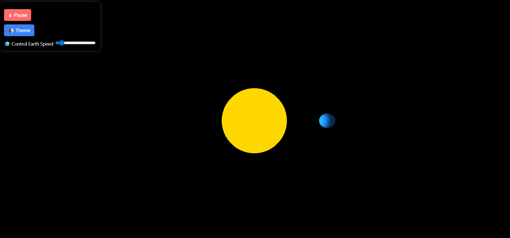

# 🌌 3D Solar System Simulation

This is a basic 3D simulation of the Earth revolving around the Sun using **Three.js**. It includes interactive UI elements like pause/play, theme toggle, and speed control for Earth's orbit.

## 🚀 Features

- 3D Sun and Earth with rotation and orbit
- Pause and Resume animation
- Switch between Light and Dark themes
- Adjustable Earth orbit speed using a slider
- Responsive UI

## 🖥️ Live Demo

🔗 [View Project Live](https://vaishnavibhawarsolarsystem.netlify.app/)

## 🛠️ Technologies Used

- HTML, CSS
- JavaScript
- [Three.js](https://threejs.org/) (CDN)

## 📸 Preview

## 📂 How to Run

1. Download or clone the repository.
2. Open `index.html` in a browser.

## ✨ Future Improvements

- Add more planets and moons
- Add stars and space background
- Add orbit paths

